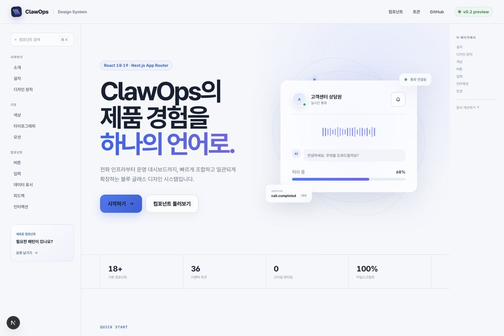
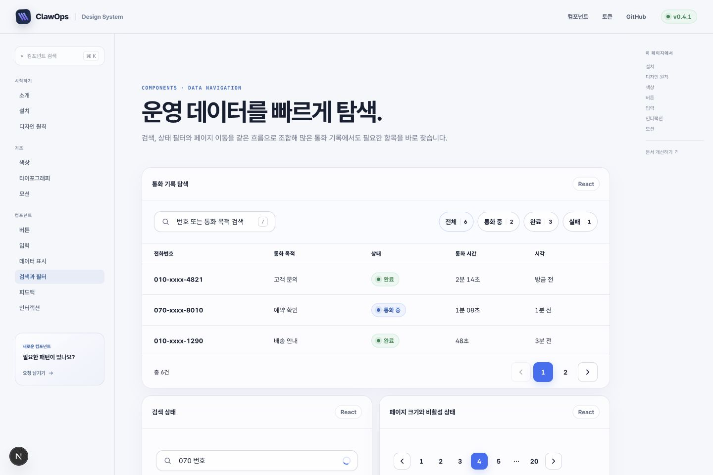
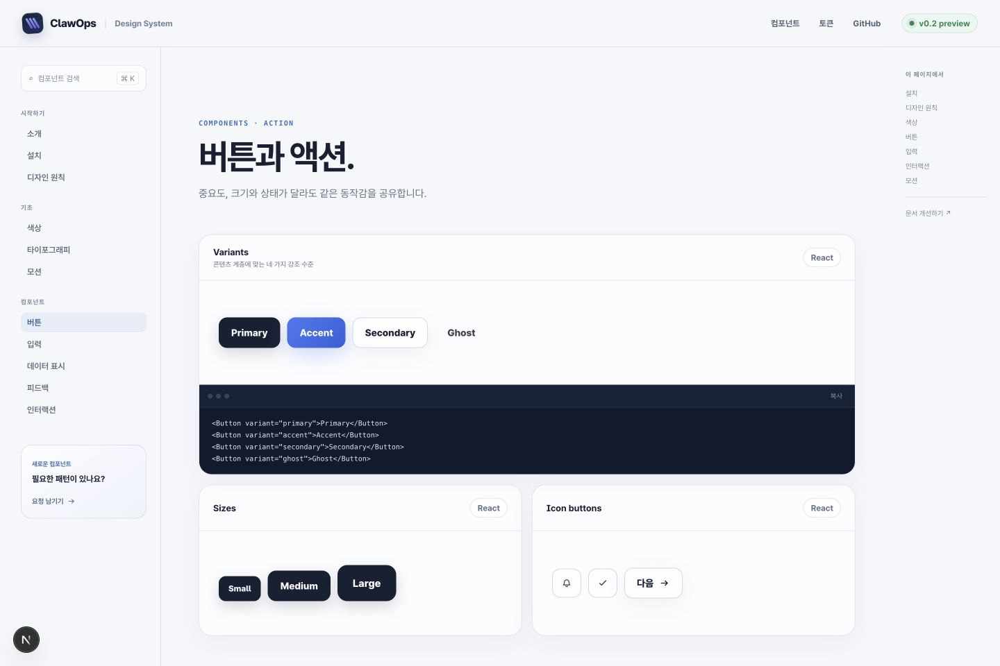
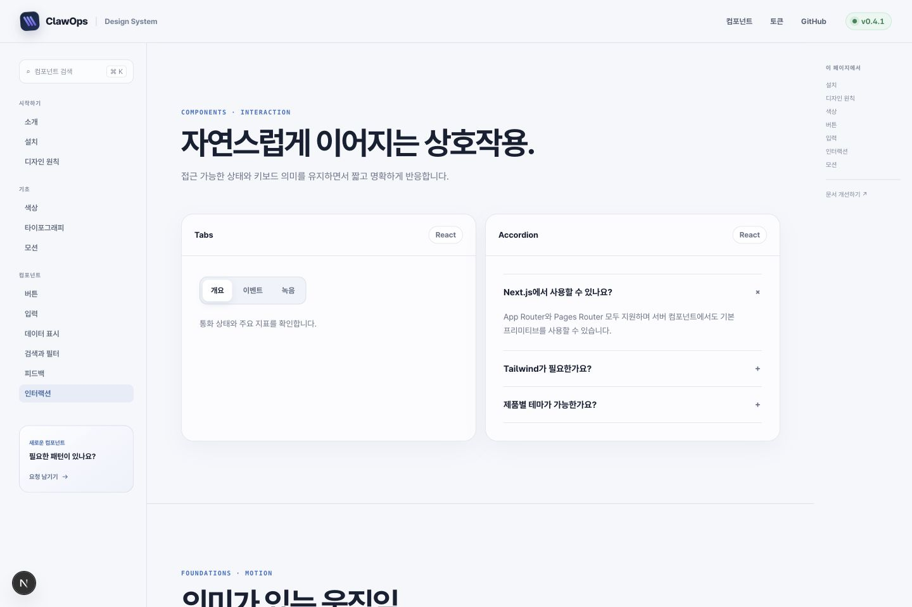
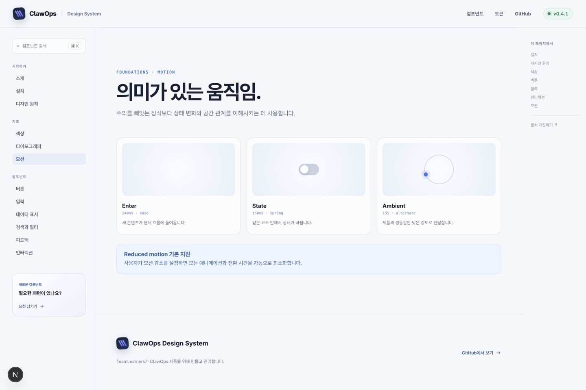
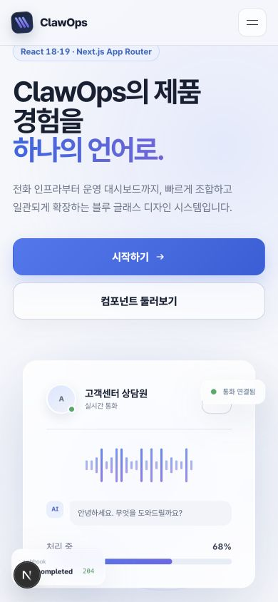

# ClawOps Design System

ClawOps 제품군에서 공통으로 사용하는 블루 글래스 디자인 시스템입니다. React 18과 19를 지원하며 Next.js에 종속되지 않습니다.

## 미리보기

토큰과 컴포넌트를 실제 ClawOps 제품 화면에 가까운 상태로 확인할 수 있는 Next.js 카탈로그를 함께 제공합니다.





<table>
  <tr>
    <td width="50%">
      
      <br />
      <strong>컴포넌트와 상태</strong>
    </td>
    <td width="50%">
      
      <br />
      <strong>접근 가능한 인터랙션</strong>
    </td>
  </tr>
  <tr>
    <td width="50%">
      
      <br />
      <strong>의미가 있는 모션</strong>
    </td>
    <td width="50%" align="center">
      
      <br />
      <strong>모바일 반응형</strong>
    </td>
  </tr>
</table>

로컬에서 전체 카탈로그를 실행하려면 아래의 [저장소 구조](#저장소-구조)를 참고하세요.

## 설치

npm 배포 전에는 GitHub 태그를 직접 설치할 수 있습니다.

```bash
npm install github:learners-superpumped/clawops-design-system#v0.7.1
```

npm 패키지가 공개된 이후에는 다음 명령을 사용합니다.

```bash
npm install @teamlearners/clawops-design-system
```

애플리케이션의 전역 스타일 진입점에서 CSS를 한 번 불러옵니다.

```tsx
import "@teamlearners/clawops-design-system/styles.css";
```

Next.js App Router에서는 루트 `app/layout.tsx`에서 스타일을 불러옵니다. 서버 컴포넌트에서도 모든 프리미티브를 바로 사용할 수 있으며, 이벤트 핸들러가 필요한 부분만 소비 앱에서 클라이언트 컴포넌트로 선언하면 됩니다.

## 시작하기

```tsx
import {
  Badge,
  Button,
  Card,
  Container,
  Field,
  Input,
  SectionHeading,
  Stack,
  Theme,
} from "@teamlearners/clawops-design-system";

export function Example() {
  return (
    <Theme>
      <Container>
        <Stack gap={8}>
          <SectionHeading
            eyebrow="파트너 프로그램"
            title="ClawOps와 함께 성장하세요."
            description="모든 ClawOps 서비스에서 같은 시각 언어를 사용합니다."
          />
          <Card tone="strong" padding={8}>
            <Stack>
              <Badge tone="success" dot>
                연결 가능
              </Badge>
              <Field label="이메일" htmlFor="email">
                <Input id="email" type="email" placeholder="you@example.com" />
              </Field>
              <Button variant="accent">시작하기</Button>
            </Stack>
          </Card>
        </Stack>
      </Container>
    </Theme>
  );
}
```

### 데이터 탐색

검색, 상태 필터와 페이지 이동은 각각 독립적으로 사용하거나 운영 목록의 툴바로 조합할 수 있습니다.

```tsx
<SearchField
  label="통화 검색"
  value={query}
  onValueChange={setQuery}
  placeholder="번호 또는 통화 목적 검색"
  shortcut="/"
/>

<FilterBar label="통화 상태 필터">
  <FilterChip selected count={18}>통화 중</FilterChip>
  <FilterChip count={42}>완료</FilterChip>
</FilterBar>

<Pagination
  page={page}
  pageCount={12}
  onPageChange={setPage}
  siblingCount={1}
/>
```

모바일처럼 공간이 좁은 화면에서는 `<Pagination compact />`를 사용합니다. 모든 문구는 `label`, `previousLabel`, `nextLabel`, `getPageLabel`, `clearLabel`, `loadingLabel`로 지역화할 수 있습니다.

## 구성 원칙

- `tokens.css`: 색상, 간격, 모서리, 그림자, 타이포, 모션의 단일 기준
- `styles.css`: 프레임워크에 의존하지 않는 컴포넌트 스타일
- React primitives: Button, IconButton, Card, Badge, Field, Input, Textarea, SectionHeading, Container, Stack, Inline, Grid, Ambient
- Interactive components: Tabs, Switch, Accordion, Tooltip
- Product navigation and overlays: NavigationTabs, Dialog, ConfirmDialog, Drawer
- Feedback and data display: Callout, Avatar, Progress, Skeleton, Spinner, Separator, Stat
- Data navigation: SearchField, FilterBar, FilterChip, Pagination
- 모든 클래스는 `co-` 접두사를 사용해 기존 프로젝트 CSS와 충돌하지 않습니다.
- 색상이나 간격을 제품별로 바꿀 때는 컴포넌트를 포크하지 않고 `--co-*` 토큰을 덮어씁니다.
- 모션 감소 환경과 키보드 포커스를 기본 지원합니다.

## 저장소 구조

```text
src/                  패키지 소스와 디자인 토큰
tests/                컴포넌트 렌더링 계약 테스트
examples/next-app/    Next.js App Router 통합 예제
assets/screenshots/   README와 릴리스용 실제 렌더링 캡처
.github/workflows/    Node 20·22 CI와 npm 릴리스
```

Next.js 예제를 실행하려면 다음 명령을 사용합니다.

```bash
npm install
npm --workspace @clawops-design-system/next-example run dev
```

## 테마 확장

```css
.my-product-theme {
  --co-color-primary: #315fdc;
  --co-container: 1240px;
  --co-radius-lg: 24px;
}
```

```tsx
<Theme className="my-product-theme">...</Theme>
```

## 배포

1. 변경 내용을 릴리스 PR로 기록하고 버전을 갱신합니다.
2. `npm run check`와 Next.js 예제 빌드를 통과시킵니다.
3. `v*` 태그로 GitHub Release를 발행하면 Actions가 npm provenance와 함께 공개 배포합니다.
4. 저장소의 `NPM_TOKEN` 시크릿이 필요합니다.
5. 제품에서는 정확한 버전을 사용하고 Renovate/Dependabot으로 업데이트합니다.

시맨틱 버저닝을 따릅니다. 토큰 삭제, prop 제거, 기본 동작 변경은 major 변경입니다.
